# Kasra — Autonomous Business Operations Agent

Kasra is an AI‑powered autonomous agent that manages business operations end‑to‑end. It plans, executes tools, learns from mistakes, and proactively suggests next steps. Built for the **Google Cloud Rapid Agent Hackathon 2026**.

[](LICENSE)
[](https://youtu.be/your-demo-link)

---

## Table of Contents

- [Features](#features)
- [Tech Stack](#tech-stack)
- [Environment Variables](#environment-variables)
- [Google Cloud Services Used](#google-cloud-services-used)
- [Getting Started](#getting-started)
- [Usage](#usage)
- [Project Structure](#project-structure)
- [Evaluation & Tracing](#evaluation--tracing)
- [Database Support](#database-support)
- [Production Readiness](#production-readiness)
- [Known Limitation](#known-limitation)
- [Demo Video](#demo-video)
- [License](#license)

---

## Features

### 🧠 Autonomous Multi‑Step Execution
- 15‑turn agentic loop with state ledger
- Tool dependency graph (providers → consumers)
- Automatic retry with circuit breaker and timeouts

### 🛠️ 30+ Real‑World Tools
- **Inventory**: get, update, forecast
- **Generic Database**: discover tables, query, insert, update, delete rows — manage any business data
- **Exports**: Excel, PDF, iCal
- **Web**: search, browse, OCR (images, PDF, Word, Excel)
- **Desktop**: screenshots, open apps, type, press keys, create files via local agent
- **Browser**: navigate, click, fill forms (Playwright)
- **Communication**: email (Gmail SMTP), Telegram
- **Integrations**: GitLab, Arize, Fivetran, Elasticsearch, Dynatrace (MCP + REST)
- **Code Execution**: Python sandbox
- **Scheduling**: cron tasks (pause/resume/stop/edit/delete)

### 🧬 Self‑Improvement Engine
- Automatic skill creation from successful workflows
- Quality‑ranked memory with auto‑pruning
- Episodic memory with semantic search

### 🧾 Transparent Reasoning
- Real‑time reasoning steps shown as a collapsible timeline
- Loading indicator with current step description

### 👤 Human‑in‑the‑Loop
- Confirmation dialog for dangerous operations (update stock, delete cron, send email, desktop control)

### 🔍 AI‑Controlled File Discovery
- Agent can search the filesystem, extract file content, and inject it into the chat automatically

### ⌨️ Slash Command Panel
- `/model` to select preferred LLM provider
- `/tool` to suggest a specific tool for the next request

### 🌐 Multi‑LLM Fallback
- Providers: Gemini, Cloudflare Workers AI, Groq, Cerebras, HuggingFace, OpenRouter
- Preferred model selection with automatic fallback

### 📊 Live Dashboard
- Real‑time view of inventory, customers, scheduled tasks, and recent agent executions
- Manual refresh button with cache‑busting

### 🖥️ Google Cloud Deployment
- Backend runs on **Cloud Run** (or Render for demo)
- Files stored in **Cloud Storage**
- Cron jobs managed by **Cloud Scheduler**
- Tracing & evaluation via **Arize AI**

---


### High‑Level Flow

```mermaid
flowchart TD
    subgraph Frontend["Frontend – Next.js"]
        UI[Chat Interface]
        Dash[Live Dashboard]
        Task[Task Log]
        Session[Session Slide Panel]
        Slash[Slash Command Panel]
        SSE_Client[SSE Event Listener]
    end

    subgraph Backend["Backend – Express.js"]
        API[REST API]
        Orchestrator[Orchestrator – Agentic Loop]
        ToolsHub[ToolsHub – 30+ Tools]
        Memory[Memory System – 4 Layers]
        SelfImprove[Self‑Improvement Engine]
        Scheduler[Cron Scheduler]
        SSE_Server[SSE Event Emitter]
        Confirmation[Confirmation Handler]
    end

    subgraph LLM["LLM Providers"]
        Gemini[Google Gemini]
        Cloudflare[Cloudflare Workers AI]
        Groq[Groq]
        Cerebras[Cerebras]
        HuggingFace[HuggingFace]
        OpenRouter[OpenRouter]
    end

    subgraph GCP["Google Cloud Services"]
        CloudRun[Cloud Run]
        VertexAI[Vertex AI Agent Builder]
        CloudStorage[Cloud Storage]
        CloudScheduler[Cloud Scheduler]
    end

    subgraph Partners["Partner Integrations"]
        Elastic[Elasticsearch – MCP]
        GitLab[GitLab API]
        Fivetran[Fivetran API]
        Dynatrace[Dynatrace API]
        Arize[Arize AI – Tracing]
    end

    UI --> API
    API --> Orchestrator
    Orchestrator --> ToolsHub
    Orchestrator --> Memory
    Orchestrator --> SelfImprove
    Orchestrator --> LLM
    Orchestrator --> Confirmation
    Scheduler --> Orchestrator
    SSE_Server --> SSE_Client
    ToolsHub --> Partners
    ToolsHub --> GCP
    LLM --> Gemini
    LLM --> Cloudflare
    LLM --> Groq
    LLM --> Cerebras
    LLM --> HuggingFace
    LLM --> OpenRouter
    CloudRun --> Backend
    VertexAI --> Gemini
    CloudStorage --> ToolsHub
    CloudScheduler --> Scheduler
    Arize --> Orchestrator
```



---

## Tech Stack

| Layer | Technology |
|-------|-----------|
| **Frontend** | Next.js 14 (React), TypeScript, Tailwind CSS, Framer Motion, Three.js |
| **Backend** | Node.js, Express, TypeScript |
| **Database** | SQLite (via better-sqlite3) with FTS5 |
| **LLM Providers** | Google Gemini, Cloudflare Workers AI, Groq, Cerebras, HuggingFace, OpenRouter |
| **OCR** | Tesseract.js, pdf-parse, pdfreader, mammoth, xlsx |
| **Code Execution** | Child process Python sandbox |
| **Memory** | Vector store (JSON) + SQLite tables (memoire, self-improve, session facts) |
| **Real-time** | Server-Sent Events (SSE) |
| **Scheduling** | Custom cron engine (cron-parser) |
| **Deployment** | Render (backend), Vercel (frontend), Google Cloud Run (ready) |

---

## Environment Variables

Create a `.env` file in the `backend/` folder. The table below lists every variable, its purpose, and where to obtain it.

### LLM Providers (at least one required)

| Variable | Purpose | How to get |
|----------|---------|------------|
| `GROQ_API_KEY` | Groq – fast, free tier (14K requests/day) | [Groq Console](https://console.groq.com/keys) |
| `GEMINI_API_KEY` | Google Gemini – primary reasoning engine (15 req/min free tier) | [Google AI Studio](https://aistudio.google.com/apikey) |
| `CEREBRAS_API_KEY` | Cerebras – 1M free tokens/day (primary fallback) | [Cerebras Cloud](https://cloud.cerebras.ai) |
| `HUGGINGFACE_TOKEN` | HuggingFace Inference | [HuggingFace Tokens](https://huggingface.co/settings/tokens) |
| `OPENROUTER_API_KEY` | OpenRouter – free model access | [OpenRouter](https://openrouter.ai/keys) |
| `CLOUDFLARE_ACCOUNT_ID` | Cloudflare Workers AI account | [Cloudflare Dashboard](https://dash.cloudflare.com) |
| `CLOUDFLARE_API_TOKEN` | Cloudflare Workers AI token | [Cloudflare Dashboard](https://dash.cloudflare.com) |

### Email (Gmail SMTP)

| Variable | Purpose | How to get |
|----------|---------|------------|
| `EMAIL_USER` | Your Gmail address | e.g. `your-email@gmail.com` |
| `EMAIL_PASS` | 16‑digit Gmail App Password | [Google App Passwords](https://myaccount.google.com/apppasswords) |
| `EMAIL_SERVICE` | Email service name (optional) | e.g. `Gmail` |

### Partner Integrations (optional – for enterprise demos)

| Variable | Purpose | How to get |
|----------|---------|------------|
| `GITLAB_TOKEN` | GitLab personal access token | [GitLab Tokens](https://gitlab.com/-/profile/personal_access_tokens) |
| `GITLAB_PROJECT_ID` | GitLab project path | e.g. `username/project-name` |
| `FIVETRAN_API_KEY` | Fivetran API key | [Fivetran](https://fivetran.com) |
| `FIVETRAN_API_SECRET` | Fivetran API secret | [Fivetran](https://fivetran.com) |
| `FIVETRAN_CONNECTOR_ID` | Fivetran connector ID | [Fivetran](https://fivetran.com) |
| `ELASTICSEARCH_URL` | Elasticsearch cluster URL | [Elastic Cloud](https://cloud.elastic.co) |
| `ELASTICSEARCH_API_KEY` | Elasticsearch API key (Base64) | [Elastic Cloud](https://cloud.elastic.co) |
| `DYNATRACE_URL` | Dynatrace environment URL | [Dynatrace](https://www.dynatrace.com) |
| `DYNATRACE_API_TOKEN` | Dynatrace API token | [Dynatrace](https://www.dynatrace.com) |

### Arize AI Tracing

| Variable | Purpose | How to get |
|----------|---------|------------|
| `ARIZE_API_KEY` | Arize Cloud API key | [Arize](https://arize.com) |
| `ARIZE_SPACE_ID` | Arize Space UUID | [Arize](https://arize.com) |
| `PHOENIX_ENDPOINT` | Self‑hosted Phoenix (optional) | e.g. `http://localhost:6006` |

### Telegram Bot

| Variable | Purpose | How to get |
|----------|---------|------------|
| `TELEGRAM_BOT_TOKEN` | Telegram Bot API token | [BotFather](https://t.me/BotFather) |

### Server

| Variable | Purpose |
|----------|---------|
| `PORT` | Backend port (default: `3001`) |
| `NEXT_PUBLIC_API_URL` | Frontend API URL (default: `http://localhost:3001`) |


---

## Google Cloud Services Used

| Service | Purpose |
|---------|---------|
| **Vertex AI Agent Builder** | Agent reasoning pattern (Gemini as primary model) |
| **Gemini API** | Primary LLM for multi‑step reasoning |
| **Cloud Run** | Serverless container hosting (Dockerfile ready) |
| **Cloud Storage** | Persistent storage for generated files (Excel, PDF, screenshots) |
| **Cloud Scheduler + Cloud Tasks** | Managed cron job execution (portable from local scheduler) |

---

## Getting Started

### Prerequisites

- Node.js ≥ 20
- Python ≥ 3.8 (for code execution)
- API keys for at least one LLM provider (Gemini recommended)

### Installation

```bash
git clone https://github.com/akdi3679/kasra-agent.git
cd kasra-agent
cd backend && npm install
cd ../frontend && npm install
```

### Run Locally

```bash
# Terminal 1:
cd backend && npm run dev

# Terminal 2:
cd frontend && npm run dev
```

Open http://localhost:3000

---

## Usage

| Prompt | Result |
|--------|--------|
| "Show inventory" | Fetches data, displays a table with highlighted values |
| "Show all database tables, then add a new customer" | Lists tables, inserts a row into any table |
| "Show inventory as table, export to Excel, and generate a PDF report" | Multi‑step execution with three outputs |
| "Using Python, compute the square root of total stock" | Executes real Python code, shows result |
| "Send an email with the inventory report" | Sends a real email via Gmail SMTP |
| "Find budget.csv on my computer and summarise it" | AI‑controlled file discovery with OCR |
| "Schedule a weekly inventory check every Monday at 9 AM" | Creates a cron job with email notification |
| "Set iPhone 15 Pro stock to 0" | Confirmation dialog, then update |
| "Search the web for trending electronics" | Multi‑engine web search (Google, DuckDuckGo, Wikipedia) |

Use `/tool` to suggest a specific tool, or `/model` to switch the preferred LLM provider.

---

## Project Structure

```
kasra/
├── backend/
│   ├── data/
│   │   ├── kasra.db
│   │   ├── kasra.db-shm
│   │   └── kasra.db-wal
│   ├── plugins/
│   │   └── example.js
│   ├── src/
│   │   ├── core/
│   │   │   └── scheduler.ts
│   │   ├── files/
│   │   │   └── index.ts
│   │   ├── lib/
│   │   │   ├── arize.ts
│   │   │   └── llm.ts
│   │   ├── memory/
│   │   │   └── self-improve.ts
│   │   ├── prompts/
│   │   │   └── system.ts
│   │   ├── tools/
│   │   │   ├── circuit-breaker.ts
│   │   │   ├── embedder.ts
│   │   │   ├── hub.ts
│   │   │   ├── mcp-client.ts
│   │   │   └── partner-tools.ts
│   │   ├── confirmation.ts
│   │   ├── events.ts
│   │   ├── ocr-extractor.ts
│   │   ├── orchestrator.ts
│   │   └── server.ts
│   ├── .env.example
│   ├── kasra-local-agent.js
│   ├── package-lock.json
│   ├── package.json
│   ├── tsconfig.json
│   └── vector_memory.json
│
├── frontend/
│   ├── app/
│   │   ├── favicon.ico
│   │   ├── globals.css
│   │   ├── layout.tsx
│   │   └── page.tsx
│   ├── components/
│   │   ├── BlobAvatar.tsx
│   │   ├── Chat.tsx
│   │   ├── ConfirmationDialog.tsx
│   │   ├── CronNotification.tsx
│   │   ├── Dashboard.tsx
│   │   ├── Dock.tsx
│   │   ├── InputArea.tsx
│   │   ├── LocalAgentButton.tsx
│   │   ├── ReasoningTimeline.tsx
│   │   ├── RequestLocalFileListener.tsx
│   │   ├── Results.tsx
│   │   ├── SessionSlidePanel.tsx
│   │   ├── SlashCommandPanel.tsx
│   │   ├── StatusBar.tsx
│   │   ├── TaskLog.tsx
│   │   └── ToolTester.tsx
│   ├── hooks/
│   │   └── useAgentEvents.ts
│   ├── public/
│   │   └── sounds/
│   │       ├── init.mp3
│   │       └── transition.mp3
│   ├── .gitignore
│   ├── README.md
│   ├── eslint.config.mjs
│   ├── next-env.d.ts
│   ├── next.config.ts
│   ├── package-lock.json
│   ├── package.json
│   ├── postcss.config.mjs
│   ├── tailwind.config.js
│   └── tsconfig.json
│
├── LICENSE
└── README.md
```

---

## Evaluation & Tracing

Kasra integrates with **Arize AI** for agent evaluation. Every agent step is traced: turn number, session ID, goal, reasoning text, commands used, output produced, status (success/failed/retry). Traces are sent to Arize Cloud via OTLP. Set `ARIZE_API_KEY` and `ARIZE_SPACE_ID` in your `.env` file.

---

## Database Support

Kasra's generic database tools (`list_tables`, `describe_table`, `query_table`, `insert_row`, `update_row`, `delete_row`) work with any SQL database. In this demo, a local SQLite database is used for portability and zero‑configuration setup. For production deployment, simply replace the SQLite connection with a PostgreSQL, MySQL, or Google Cloud SQL connection string — the agent's SQL interface remains identical.

---

## Production Readiness

Kasra is designed to be database‑agnostic. The current demo uses a local SQLite database for simplicity, but the codebase supports swapping to any SQL database in minutes. All database operations go through parameterized queries, protecting against SQL injection. The agent always asks for confirmation before destructive operations (UPDATE, DELETE) regardless of the underlying database engine.

---

## Known Limitation

The Render free tier blocks outbound HTTPS requests on non‑standard ports, which prevents Arize OTLP traces and SMTP email from reaching their destinations. The code is fully implemented and tested locally. For production use, deploy on **Google Cloud Run** (Dockerfile included) where there are no outbound restrictions.

---

## Demo Video

Watch the full demo here: [link]

The video demonstrates multi‑step workflow, database discovery, human‑in‑the‑loop confirmation, AI‑controlled file discovery, Python code execution, slash command panel, self‑improvement, Telegram integration, and more.

---

## License

MIT License – see [LICENSE](LICENSE) for details.